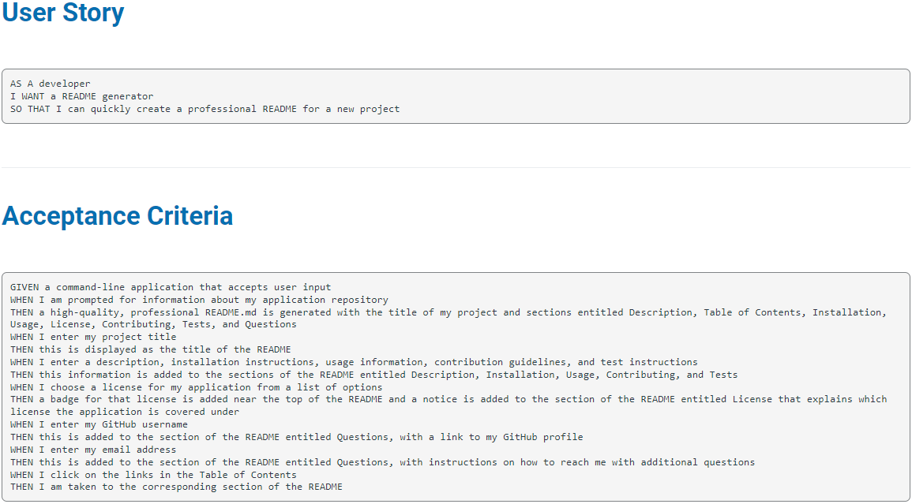

# Readme generator      
# Description 

This application creates a quality readme with user's input. Once user starts the application he will be asked to provide title and description of the readme, which are mandatory as any readme should have a title and a brief description. The rest of the questions are optional and if user does not provide input that section on readme will be filled out with N/A.
# Table of content 
* [Installation](#installation)
* [Usage](#usage) 
* [Contribute](#contributing) 
* [Tests](#tests) 
* [Questions](#questions) 

# Installation 

#### Install Node.js, inquierer 8.2.4 (npm I inquierer@8.2.4)
# Usage 

# Demo 

# License 

This application is covered under MIT, to find more information about it click on https://choosealicense.com/licenses/mit/. 
# Contributing 
#### N/A

x
# Tests 

The following is needed to run the rest:

#### node index.js
# Questions 

If you have any additional questions you can reach me at jelena.rogic90@gmail.com. 

Link to my Github profile: https://github.com/JelenaRog
